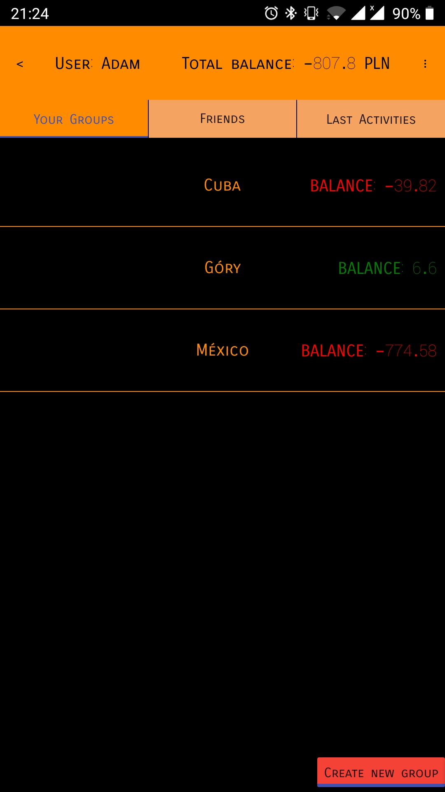
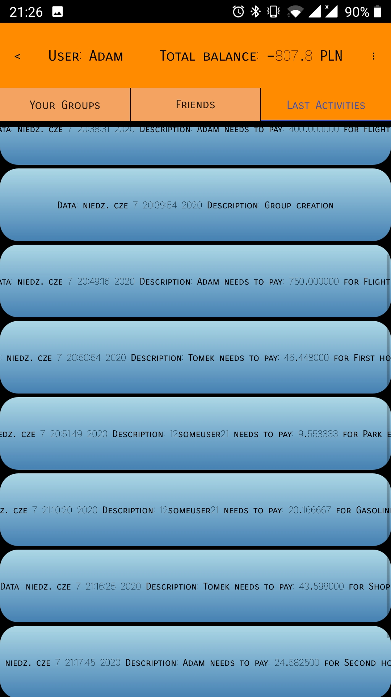

# Trip cost calculator
### General description

The application allows users to calculate expenses for a group of people, e.g. during travels. All new expenses can be added equally or separately for selected group members. History of all activities and balance with each group member are easily available in group tabs. The app is portable and can be compile on destop or mobile phones (Android).

### Used tools
Written in Qt environment using:
- QML in the frontend layer
- C++ and SQLite database in the backend layer

### Functionality
- user registration and validation with password
- group creations
- group operations (adding new bills, balance clearing, adding users to group)
- history of all group activities
- making friendship to quickly check balance with friends
- informing about actual currency rate

### Images

  
   

  
   

### Setup
Qt 5.14 framework is required to compile program.
To emulate app on Android, please refer to https://doc.qt.io/qt-5/android-getting-started.html, https://doc.qt.io/qtcreator/creator-developing-android.html and https://doc.qt.io/qt-5/android-building.html.
If you want to run test project (from /tests folder), you need to install gtest/gmock. Next edit test.pro file and add path to generated gtest library file, line to edit:

`LIBS += -Lpath_to/your_gtest/lib -lgtest`

### Status
Not all functionalities supported on Android.
